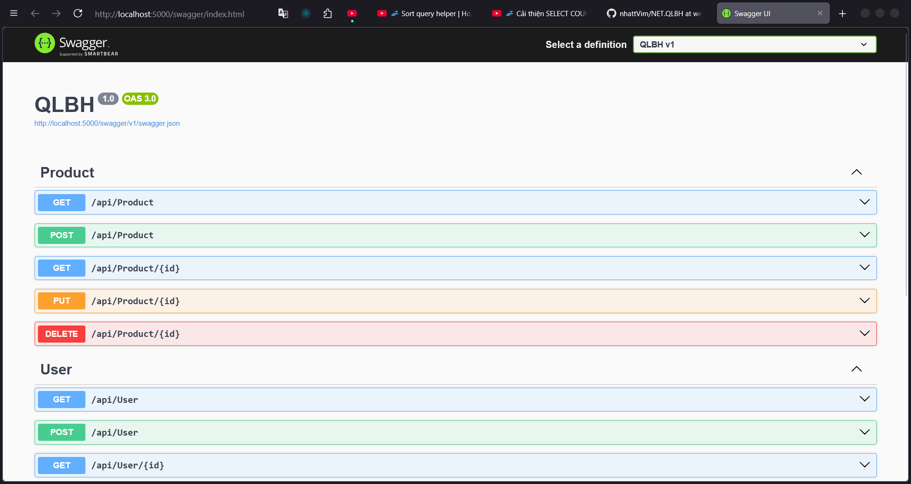
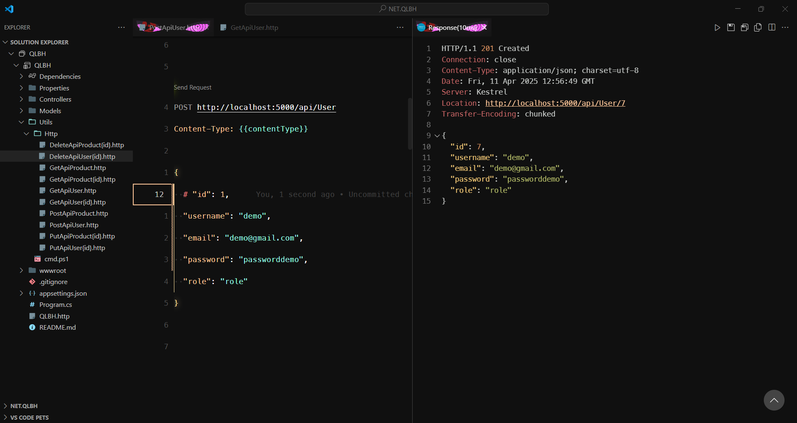
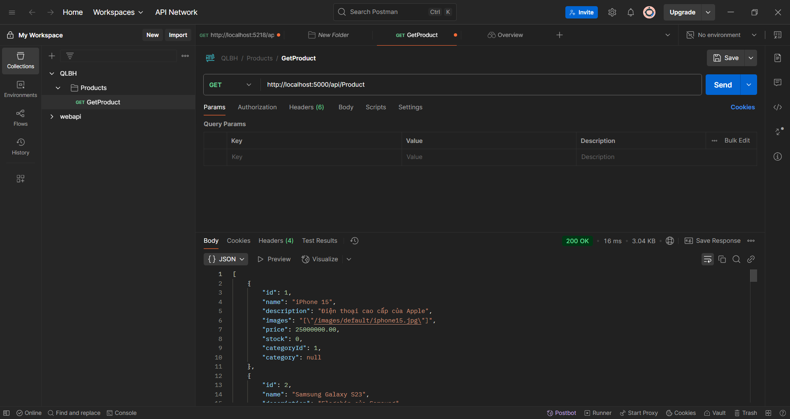

# [MVC](https://github.com/nhattVim/NET.QLBH/tree/mvc) | [Razor page](https://github.com/nhattVim/NET.QLBH/tree/razorpagek)

## QLBH - Quản Lý Bán Hàng

-   QLBH là một ứng dụng web được xây dựng bằng ASP.NET Core Razor Pages, nhằm hỗ trợ quản lý sản phẩm, danh mục, và các chức năng liên quan đến bán hàng. Đây chỉ là một bài thực hành trên trường, nên dự án chưa hoàn thiện và có thể thiếu một số tính năng quan trọng

-   Dự án này cung cấp các tính năng như:

    -   Thêm, sửa, xóa sản phẩm.
    -   Tìm kiếm và lọc sản phẩm theo danh mục.
    -   Quản lý danh mục sản phẩm.
    -   Hiển thị danh sách sản phẩm với hình ảnh.

## Công nghệ sử dụng

-   **ASP.NET Core**: Framework chính để xây dựng ứng dụng web.
-   **Entity Framework Core**: ORM để làm việc với cơ sở dữ liệu.
-   **Bootstrap**: Thư viện CSS để tạo giao diện người dùng.
-   **SQL Server**: Cơ sở dữ liệu để lưu trữ thông tin sản phẩm và danh mục.

## Giao diện

### Danh sách sản phẩm



### Chi tiết sản phẩm


### Thêm sản phẩm mới


### Tìm kiếm sản phẩm



### Lọc sản phẩm theo danh mục



## Hướng dẫn chạy dự án

1.  **Cài đặt các công cụ cần thiết**:

    -   [.NET SDK](https://dotnet.microsoft.com/download)

        Cài đặt EF Core Tools:

        ```powershell
        dotnet tool install --global dotnet-ef
        ```

    -   [SQL Server](https://www.microsoft.com/en-us/sql-server/sql-server-downloads)

2.  **Clone dự án về máy**

    -   mvc `git clone -b mvc https://github.com/nhattVim/NET.QLBH.git --depth 1`

    -   razor page `git clone -b razorpage https://github.com/nhattVim/NET.QLBH.git --depth 1`

3.  **Cấu hình cơ sở dữ liệu**:

    -   Cập nhật chuỗi kết nối trong file `Models/QLBHContext.cs`.

4.  **Tạo và áp dụng Migration**

    -   Tạo migration đầu tiên (nếu chưa có):

        ```powershell
        dotnet ef migrations add InitialCreate
        ```

    -   Cập nhật cơ sở dữ liệu:

        ```
        dotnet ef database update
        ```

5.  **Chạy ứng dụng**:

    -   Mở terminal và chạy lệnh:
        ```bash
        dotnet watch run
        ```
    -   Truy cập ứng dụng tại `http://localhost:5000`.
    -   Truy câp vào trang product trên navbar và nhấn nút nạp sản phẩm

## Đóng góp

Nếu bạn muốn đóng góp cho dự án, vui lòng tạo một pull request hoặc mở một issue mới.
